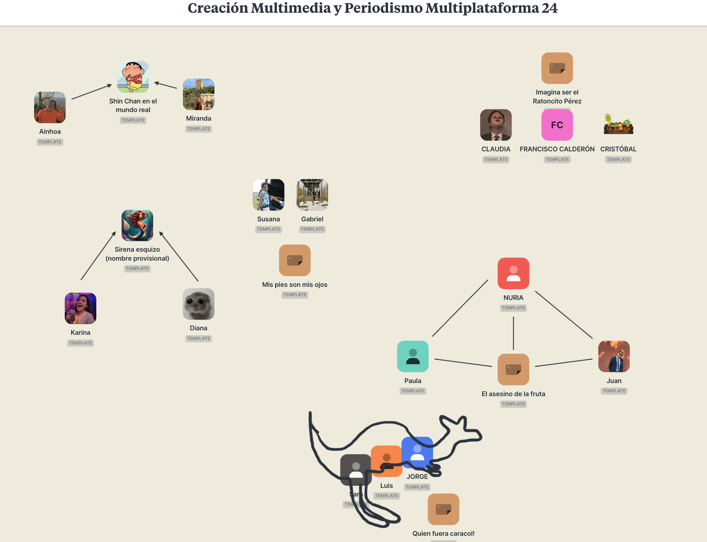
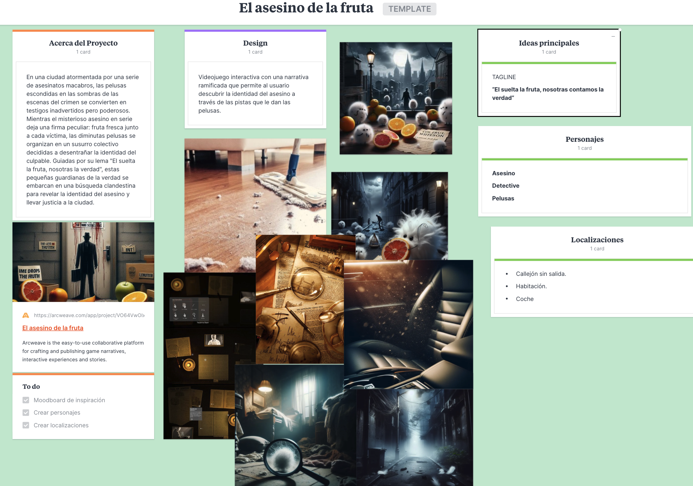
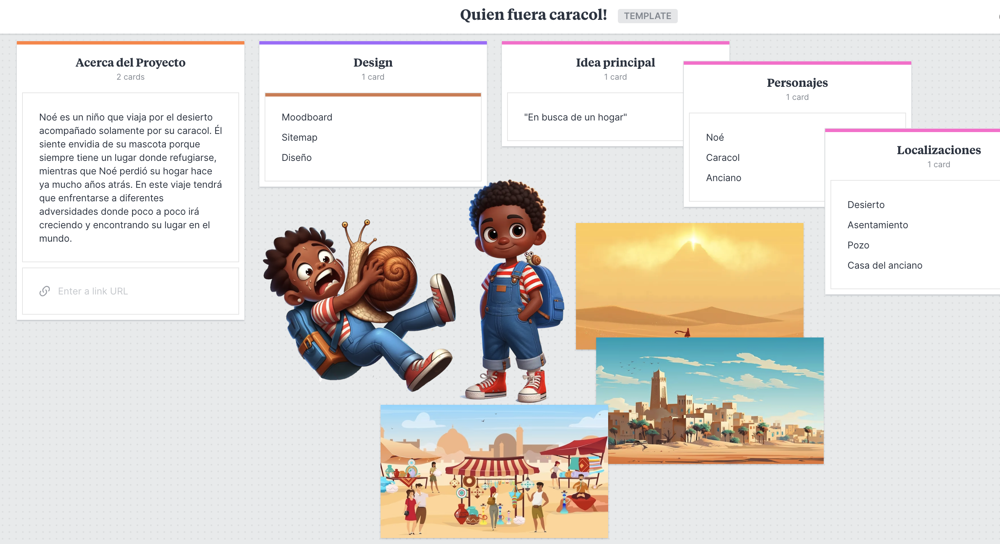
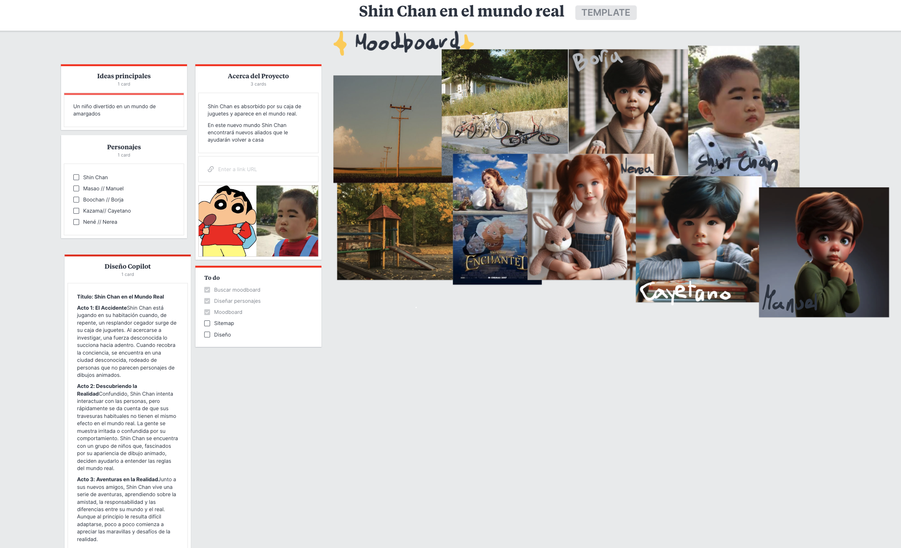
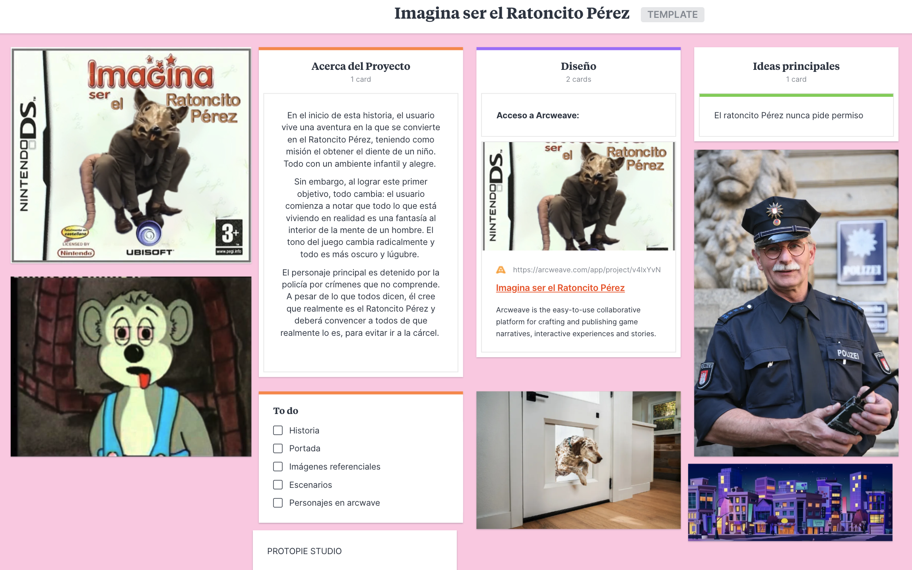
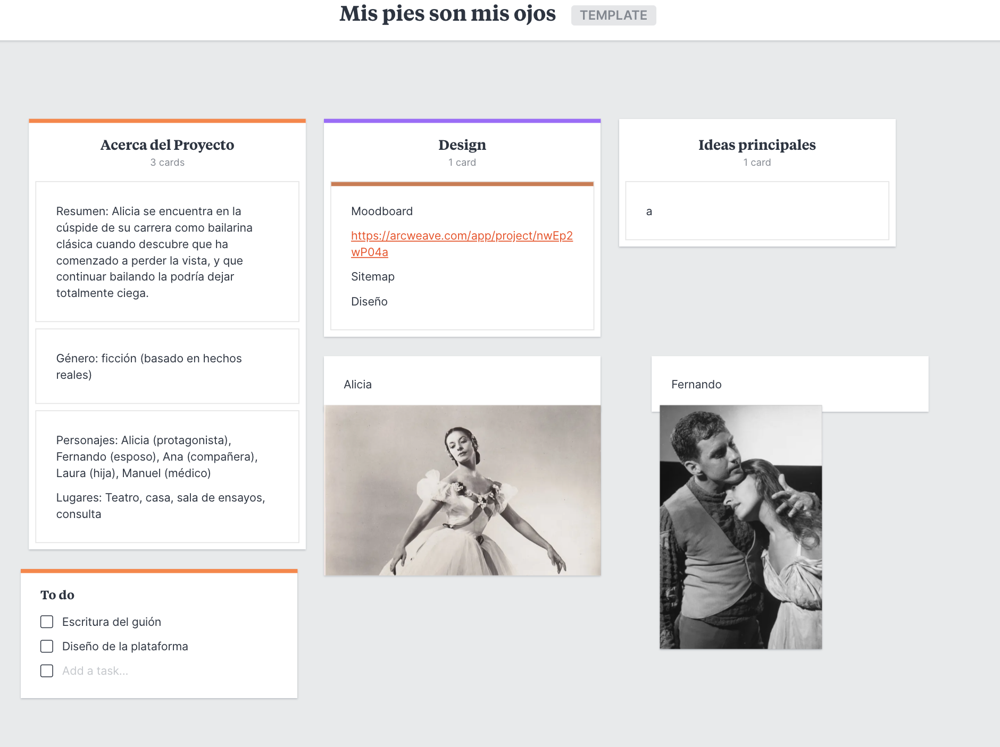

## Proyectos de Creación Multimedia

### Asesino de la fruta
* Github:[Asesion en serie](https://github.com/nuriafdz1/nuriafdz1.github.io)
* ArcWeave: https://arcweave.com/app/project/VO64VwOlxY/play
* Protopie: https://cloud.protopie.io/p/2c6c25e18bef3cd6eb4615a1
* Vev: https://a-elasesinodelafruta.vev.site/el-asesino-de-la-fruta

### Quien fuera caracol
* Github:  https://github.com/jxrg98/jxrg98.github.io/

### Echoes of the Sea
* Github: https://github.com/karinazeballos/karinazeballos.github.io

### Shin Chan en el mundo real

* Documentación en Github:  https://github.com/whoismir/
* Proyectos: https://whoismir.github.io/

### Imagina ser el Ratoncito Pérez

* Github: https://github.com/panchocq/panchocq.github.io

### Mis pies son mis ojos

* Github: https://github.com/gabbalord/PeriodismoMultimedia_Template
* RenP'y: https://gabbalord.github.io/uwu

Abril 2024

