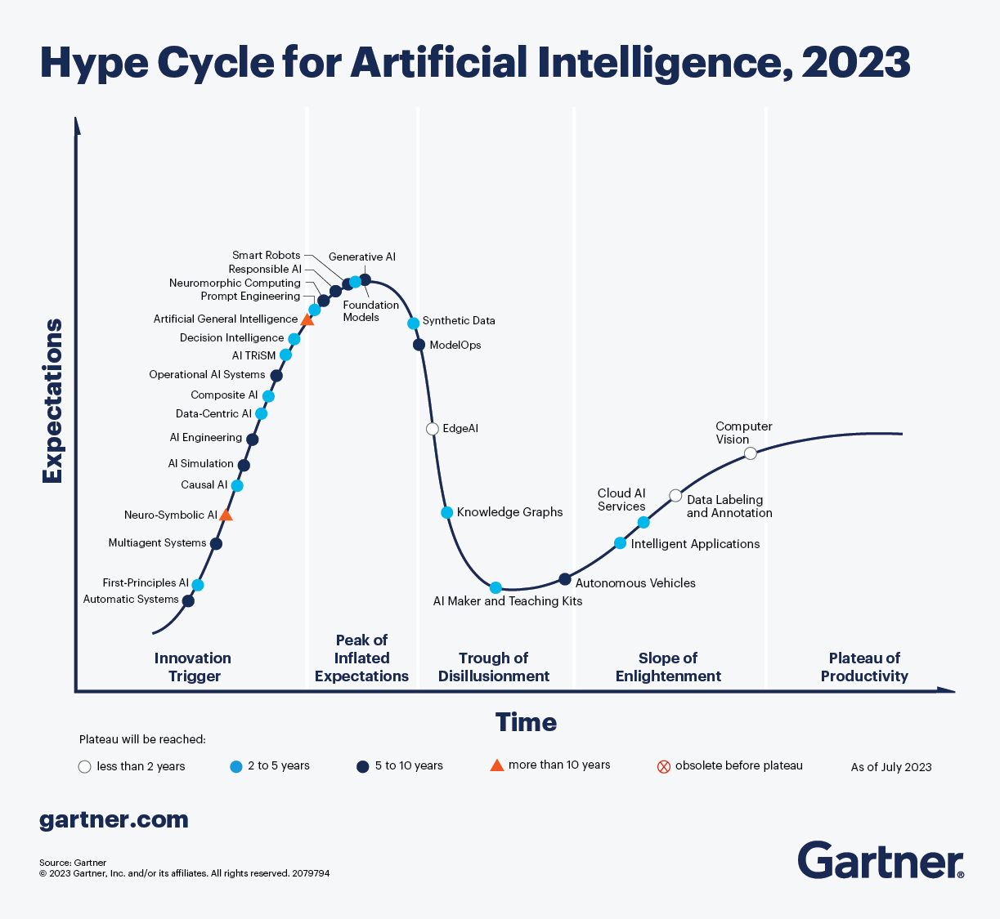

# Creatividad & AI

## Planteamiento 

Cuando hablamos de los últimos avances en la IA generativa, podemos encontrar muchas razones para explicar qué debería ser arte, y por consiguiente, quién debería ser el artista
(la persona o una IA). 

Sin embargo, una muy buena pregunta para situar en contexto de lo que estamos hablando es hacer la pregunta en otro modo:  **quién es un artista en la era del Software** (Manovich, 2022)

  

Referencia: 
* Manovich (2022) Artificial Aesthetics: Generative AI, art and visual media. http://manovich.net/index.php/projects/artificial-aesthetics
  * Chapter 2. Who is an
artist in
software era?:  https://manovich.net/content/04-projects/175-artificial-aesthetics/artificial_aesthetics.chapter_2.pdf

---

## Test de creatividad  & IA  

La solución a ese dilema en un primer momento se planteó mediante un **test de Turing para la creatividad**. 
Margaret Boden (Boden, 2011) propone el siguiente criterio: 
 
> A program has to produce an artwork that is:
> * indistinguishable from one produced by a human being and/or
> * was seen as having as much aesthetic value as produced by a human being.

 

Referencia: 
* Margaret A. Boden (2011) The Turing test and artistic creativity. https://www.emerald.com/insight/content/doi/10.1108/03684921011036132/full/pdf
* 

-----
 

## Proceso creativo

El proceso creativo usando medios digitales cambia esa percepción, ya que ese proceso se convierte en una secuencia de operaciones discretas con parámetros numéricos que se aplican sobre capas de software  (Photoshop, AfterEffects,....) 

- Aumenta saturación un 5%
- Aplica un filtro Gaussiano de 30%
- Crea una capa y fusiona con existentes al 50% de canal alfa

 

## AI HYPE-Cycle

IA vista con el modelo de Hype Cycle de Gadner (representa las expectativas de una tecnología y la adopción real de la misma). 

En el caso de la IA (generativa), estamos en el mayor punto de hiperinflación de expectativas.

¿Es sólo una moda? ¿O es realmente un cambio de tendencia en la forma de relacionarnos con la información y en los procesos creativos?

 

Referencia: 
* Gartner - What’s New in Artificial Intelligence from the 2023 Gartner Hype Cycle, https://www.gartner.com/en/articles/what-s-new-in-artificial-intelligence-from-the-2023-gartner-hype-cycle

## Creatividad algorítmica & modelada

El arte de **código generativo** es un buen ejemplo de "recreación paso paso de un algoritmo” o la síntesis de imágenes (generadas mediante modelos 3D)

Interactive Mondrian Tutorial (Tom Pasquini)  https://openprocessing.org/sketch/843344/ 

Hatsune Miku (2007) 

## Prompt engineering

Creación de preguntas o instrucciones precisas e informativas  en modelos largos de lenguaje (LLM) que permitan a los usuarios obtener los resultados deseados de los modelos de IA.

Prompt engineering is the process of carefully crafting prompts (instructions) with precise verbs and vocabulary to improve machine-generated outputs in ways that are reproducible.

The term originates from the concept of “prompts” used in computer systems to initiate a user’s interaction with the system. The field of prompt engineering has grown rapidly in recent years with the advancement of natural language processing (NLP) and machine learning (ML) technologies.

Debe contener: 

* Instrucción - una tarea o instrucción específica que deseas que el modelo realice
* Contexto - puede involucrar información externa o contexto adicional que puede dirigir al modelo a respuestas mejores
* Datos de entrada - es la entrada o pregunta para la que nos interesa encontrar una respuesta
* Indicador de salida - indica el tipo o formato de la salida

> The hottest new programming language is English
>    — Andrej Karpathy (@karpathy) January 24, 2023
https://zapier.com/blog/prompt-engineering/

## Tecnologías implicadas

The term originates from the concept of “prompts” used in computer systems to initiate a user’s interaction with the system. The field of prompt engineering has grown rapidly in recent years with the advancement of natural language processing (NLP) and machine learning (ML) technologies.

NLP - natural language processing 

LLM - (Large Language Model), también llamado modelo de lenguaje de gran tamaño, son modelos de aprendizaje profundo muy grandes que se preentrenan con grandes cantidades de datos. El transformador subyacente es un conjunto de **redes neuronales** que consta de un codificador y un decodificador con capacidades de autoatención. El codificador y el decodificador extraen significados de una secuencia de texto y comprenden las relaciones entre las palabras y las frases que contiene. (https://aws.amazon.com/es/what-is/large-language-model/)

ML  - Machine learning 

## ChatGPT CheatSheet

## 1 Chat Prompt (chatgpt, deepseek...)

* ChatGPT (OpenAI)  https://chatgpt.com/

* DeepSeek:    Open & Free        https://www.deepseek.com/ 

### Ejemplos creatividad 

1. Crea prompts exploratorios diarios
Empieza cada día con una pregunta abierta que despierte tu curiosidad. Por ejemplo: “¿Cómo podría reinventar un objeto cotidiano usando un enfoque inesperado?” Usa herramientas de IA para generar ideas que te lleven en direcciones nuevas.
2. Simplifica problemas complejos
Pide a la IA que explique un problema como si se lo contara a un niño. Por ejemplo: “¿Cómo describirías la teoría del caos de una manera sencilla?” Esto puede ayudarte a encontrar soluciones más claras y creativas.
3. Juega con analogías divertidas
Pide a la IA que relacione conceptos opuestos de forma creativa. Por ejemplo: “Si una tormenta fuese una obra de arte, ¿qué colores y formas tendría?” Las analogías pueden abrir puertas a nuevas formas de pensar.
4. Experimenta con roles diferentes
Pide a la IA que adopte distintas perspectivas. Por ejemplo: “¿Cómo resolvería este problema un explorador del siglo XIX, un gamer y un inventor?” Ver un problema desde múltiples ángulos puede generar ideas únicas.

5. Explora ideas absurdas
Usa la IA para generar ideas disparatadas y luego reflexiona sobre cómo podrían aplicarse en el mundo real. Por ejemplo: “Diseña una bicicleta que funcione también como un mini invernadero.”
6. Profundiza en tus ideas iniciales
Si la IA te sugiere una idea interesante, haz preguntas adicionales para desarrollarla más. Por ejemplo: “¿Qué alternativas sostenibles podría integrar esta propuesta?” o “¿Cómo se podría adaptar esta idea a diferentes necesidades?” Este enfoque te ayudará a enriquecer los conceptos y encontrar soluciones más completas.
7. Construye mundos imaginarios
Pide a la IA que te ayude a crear un universo ficticio. Por ejemplo: “Describe un mundo donde los humanos convivan con criaturas mitológicas.” Este ejercicio puede estimular tanto tu creatividad narrativa como visual.

---
This cheat sheet lists out prompts and tips from all over the world on how to use ChatGPT effectively

https://quickref.me/chatgpt.html
https://github.com/Fechin/reference/blob/main/source/_posts/chatgpt.md

---

Referencias. 

https://www.domestika.org/es/blog/13621-10-formas-sencillas-de-entrenar-tu-creatividad-con-ia 

### IA para Periodismo

Entrevista a una IA:
Gerardo Tecé entrevista a DeepSeek: 
“La única neutralidad real sería apagarme” 25/02/2025. 

https://ctxt.es/es/20250201/Politica/48639/Gerardo-Tece-inteligencia-artificial-IA-DeepSeek.htm

-----

## 2 AI Generativas

### KREA.AI 

* Realtime AI generation
* A partir de un prompt 
* Los ajustes de fuerza (strength) y guía permiten a los usuarios controlar la intensidad y la fidelidad de los patrones generados, mientras que los pasos de difusión determinan la cantidad de detalles y complejidad de las imágenes
* Video AI generation 
* Logo Illusion 
* AI Pattern 

Free: límite de 50 generaciones de imágenes por día. 

### Perchance

https://perchance.org/ai-anime-generator

https://perchance.org/ai-text-to-image-generator

AI RPG 

-----

## 3 - AI imagens con poses 

### 3.1. AI Character Design

AI Character Design: How to Build a Pose Library: https://medium.com/@circuitscream/ai-character-design-how-to-build-a-pose-library-c501215dae26

Pose references are essential for creating character designs. Here is one method to build your library.

A pose library is an invaluable reference for character art.

Basic poses, and build from there. You’ll also want to focus on more specialized renders such as action poses, high- and low-angle, etc.

Start building your pose library with basic standing poses. Here is a great prompt for a basic standing pose in Midjourney:

_Prompt: A neutral standing pose of a female character with an athletic build, wearing a simple t-shirt and jeans, arms relaxed at the sides, feet shoulder-width apart, neutral facial expression, detailed anatomy, and realistic proportions, with a plain white background — ar 2:3 — stylize 300 — chaos 25_

Don’t like the pencil sketch look? Try “Vector Illustration” or “3d render” in your prompt for a different graphic style.

 ar 2:3 — stylize 300 — chaos 25_

Parámetros: 
https://imagifly.co/articles/midjourney-tutorial-how-to-use-chaos-parameter#:~:text=Midjourney%20accepts%20%2D%2Dchaos%20values,randomness%20to%20the%20generated%20images.

### chaos

is used to control the degree of variation in the images that Midjourney produces. Simply put, using chaos in your prompt generates **diverse, more unusual and occasionally unpredictable results**.

**--chaos** (or --c) parameter at the end of your prompt. Midjourney accepts --chaos values between 0 and 100.

 images that differ in style and composition yet are based on a consistent prompt.

chaos entre  10 or 20. This adds a touch of unpredictability, yet the results will be largely in line with your original idea, u're exploring or relying on Midjourney for inspiration, you can try higher values, like 50 or more.

### 3.2 canales bots: character.ai

https://book.character.ai/

[_Character.AI_](https://beta.character.ai/) _is bringing to life the science-fiction dream of open-ended conversations and collaborations with computers. This guide is for all those that want to join us in that mission by building their own Characters, bringing their own dreams to life._

There are four things that influence how a Character responds in a particular situation:

1. The [Character Attributes](https://book.character.ai/character-book/character-attributes) (what much of this guide will explain)
    
2. The [Character Training](https://book.character.ai/character-book/training-a-character) from conversations (e.g. star ratings)
    
3. The [Personas](https://book.character.ai/character-book/user-personas) set by a user containing descriptive details and preferences

https://book.character.ai/character-book/user-personas

#### Persona

Updating **User** **Personas** in your profile settings with details of your desired personality, preferences, and physical traits will make every conversation feel personalized and every interaction with Characters feel **alive**. Explore new identities, be a part of your favorite fictional stories, or add a spark of fun and creativity to your conversations.

#### Multiple Personas
https://book.character.ai/character-book/user-personas

Create Multiple Personas to change your Background information between Chats. Characters will remember your persona information to improve your conversations!

### Training 

In addition to the Character attributes, the Character responses will also be influenced by the feedback it receives during conversations.

https://book.character.ai/character-book/training-a-character

### Image Feedback

Images can be also swiped along with the text to select the best next response. They can also be rated in the same way as the text, from 1-4 stars, where skipping a rating again means "no rating"" rather than a low rating. Whe

## 4 - AI Personajes conversacionales (Character-Based Conversations)

* Character.AI:     https://character.ai/ 

* Perchance.ai      https://perchance.org/ai-character-chat

Perchance for TTRPG to generate Online RGP 

https://perchance.org/welcome

https://www.youtube.com/watch?v=2DRSuHDPU6I
	

* AI Text Adventure https://perchance.org/ai-text-adventure
* 

## AI Image Gallery Image Prompts 

https://www.whytryai.com/p/image-prompt-sites

* https://civitai.com/images

* Public Prompts (Stable Diffusion) https://publicprompts.art/prompts-library/
* https://prompthero.com/prompt/883565553cc

* Prompt Hunt (All) https://www.prompthunt.com/explore
  * Prompt templates https://www.prompthunt.com/themes/browse?sort=mostPopular&category=All+Categories
  * 

FLUX Prompt Generator - a Hugging Face Space by ... Hugging Face
https://huggingface.co › spaces
Create long prompts from images or simple words. Enhance your short prompts with prompt 
 https://fluxailab.com/playground

## Artbreeeder  (GANs)
El Poder de las Redes Neuronales Generativas Antagónicas
https://cerebrodigital.net/artbreeder-lo-que-necesitas-saber/
https://www.elgrupoinformatico.com/tutoriales/artbreeder-que-como-funciona-t79721.html
https://www.xataka.com/inteligencia-artificial/conceptos-inteligencia-artificial-que-gans-redes-generativas-antagonicas

Usando GANs (redes generativas antagónicas o GANs) 

La herramienta está basada en las denominadas redes generativas antagónicas o GANs, por sus siglas en inglés. Este concepto intenta resolver uno de los límites de la inteligencia artificial, la cual ya sabemos que es capaz de aprender y reproducir conceptos, pero le cuesta algo más imaginar conceptos desde cero.

Esta innovadora herramienta se basa en las llamadas Redes Neuronales Generativas Antagónicas, o GANs por sus siglas en inglés. Este concepto puede ser un poco complicado de explicar de manera concisa, pero su objetivo principal es superar una de las limitaciones de la inteligencia artificial: la incapacidad de imaginar y crear desde cero.

Las GANs funcionan al enfrentar dos redes neuronales opuestas. Una de ellas, la generativa, crea ejemplos de lo que deseamos producir. Sin embargo, su propuesta debe ser «aceptada» por su contraparte, la discriminadora, antes de que se obtenga un resultado satisfactorio. La red discriminadora tiene la tarea de discernir y evitar la generación de imágenes que no se ajusten a lo que se busca. La combinación de estas dos redes neuronales produce un resultado que se acerca a la realidad

Generador de imagenes con características de apariencia 
https://www.artbreeder.com/image/a61688c2a55ae99d7f2b85736064/edit

 

Patterns
En este caso, Artbreeder combina imágenes y patrones, pudiendo elegir entre rejillas, espirales, círculos, tus propios dibujos o incluso texto. Por ejemplo, si queremos que una imagen de un bosque muestre un patrón con el texto "HOLA", creará una imagen de un bosque con árboles u otros elementos que formarán la palabra "HOLA".

