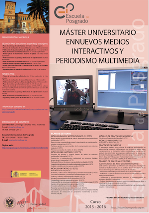

# PeriodismoMultimedia 

Contenidos, proyectos y recursos del curso: Creación Multimedia y Periodismo Multiplataforma  
[Master de Nuevos Medios Interactivos y Periodismo Multimedia](https://masteres.ugr.es/newmedia_periodismomultimedia/).  
[Cartel original de la primera edición](https://github.com/mgea/PeriodismoMultimedia/blob/master/2016/Cartel_Nuevos%20medios%20Interactivos.pdf) 

---

## Contenido 

* El contenido de la asignatura está disponible en https://mgea.github.io/PeriodismoMultimedia/

* Carpeta con el contenido: https://github.com/mgea/PeriodismoMultimedia/tree/master/content 

   

## Proyectos realizados 

Desde los comienzos en 2015/16, se han desarrollado multitud de actividades y proyectos por parte de los estudiantes de la asignatura. Aquí podemos ver un resumen de las actividades más destacadas del curso 

- [Proyecto de los estudiantes del master >>](proyectos/README.md) 

- [Repositorio con plantilla para crear ficha de proyecto](https://github.com/mgea/PeriodismoMultimedia_Template)

## Inspiración

- [The FWA](https://thefwa.com) Showing experience cutting-edge innovation in digital design and development  

- [Awwward](https://www.awwwards.com) The awards of design, creativity and innovation on the internet 

- [Submarine Channel](https://submarinechannel.com) explores the future of storytelling

Proyectos: 

- [MuseMap Street Art App — UX Case Study](https://blog.prototypr.io/musemap-street-art-app-ux-case-study-9bec6a99823b)

- 

Herramientas: 

- [Trello](https://trello.com/b/3YjvDccp/proyectomultimedia)

- [Storyboarder](https://wonderunit.com/storyboarder/) creación de storyboard de una historia (2d/3D) exporta a PDF/gif/MP4
- [Arcweave](https://arcweave.com) Diseño de narrativas para Juegos

HTML5 

- Sandbox [Codepen](https://codepen.io)
- Fundamentos para crear [contenido HTML5](https://github.com/mgea/PeriodismoMultimedia/blob/master/html5/readme.md)

Filosofía Open Source

- [Scroll-AudioFade](https://github.com/mgea/AudioFade) Proyecto resultado de reutilizar el repositorio AudioFade de @KamboBlack  

- [ScrolltoTelling](https://github.com/mgea/ScrolltoTelling) Proyecto de creación de animaciones basadas en Scrolling

## Acerca de..

 [Miguel Gea](https://mgea.github.io/about/#/), updated: 18/02/2025

