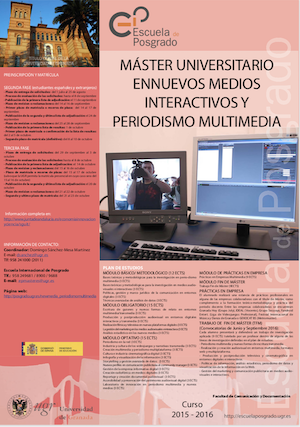

# PeriodismoMultimedia 

Contenidos, proyectos y recursos del curso: Creación Multimedia y Periodismo Multiplataforma  
[Master de Nuevos Medios Interactivos y Periodismo Multimedia](https://masteres.ugr.es/newmedia_periodismomultimedia/).  
[Cartel original de la primera edición](https://github.com/mgea/PeriodismoMultimedia/blob/master/2016/Cartel_Nuevos%20medios%20Interactivos.pdf) 

---

## Contenido 

* Presentación [en Framer](https://nice-daffodil-785408.framer.app/) 
* El contenido de la asignatura está disponible en https://mgea.github.io/PeriodismoMultimedia/
* 
* Carpeta con el contenido: https://github.com/mgea/PeriodismoMultimedia/
* Linea trabajo y TFM: https://mgea.github.io/storytelling-tfm/
* Documentación + herramientas: https://github.com/mgea/PeriodismoMultimedia/wiki

  

   

## Proyectos realizados 

Desde los comienzos en 2015/16, se han desarrollado multitud de actividades y proyectos por parte de los estudiantes de la asignatura. Aquí podemos ver un resumen de las actividades más destacadas del curso 

- [Proyecto de los estudiantes del master >>](proyectos/README.md) 

- [Repositorio con plantilla para crear ficha de proyecto](https://github.com/mgea/PeriodismoMultimedia_Template)

## Inspiración

- [Recursos inspiración](recursos.md) lista completa actualizada

Algunos de los sitios y recursos más destacados son: 

  - [The FWA](https://thefwa.com) Showing experience cutting-edge innovation in digital design and development  

  - [Awwward](https://www.awwwards.com) The awards of design, creativity and innovation on the internet 

  - [Submarine Channel](https://submarinechannel.com) explores the future of storytelling

Proyectos: 

  - Moebius::arzarch El viaje en silencio [revealJS](https://mgea.github.io/webdoc-reveal/moebius) 
  - Godot [The Faculty](godot_thefaculty26.zip)

Herramientas: 

- [Herramientas creación multimedia interactiva](https://github.com/mgea/PeriodismoMultimedia/wiki)

HTML5 

- Sandbox [Codepen](https://codepen.io)
- Fundamentos para crear [contenido HTML5](https://github.com/mgea/PeriodismoMultimedia/blob/master/html5/readme.md)

Filosofía Open Source

- [Scroll-AudioFade](https://github.com/mgea/AudioFade) Proyecto resultado de reutilizar el repositorio AudioFade de @KamboBlack  

- [ScrolltoTelling](https://github.com/mgea/ScrolltoTelling) Proyecto de creación de animaciones basadas en Scrolling

## Acerca de..

 [Miguel Gea](https://mgea.github.io/about/#/), updated: 18/02/2025

