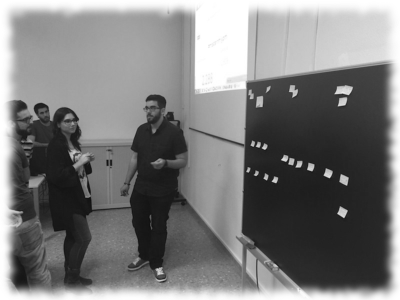

# PeriodismoMultimedia 2015/16 

Proyectos que se van a desarrollar en la asignatura dentro de la [1ª edición del Master](https://github.com/mgea/PeriodismoMultimedia/blob/master/2016/Cartel_Nuevos%20medios%20Interactivos.pdf)

Proceso de generación de ideas: 

* Temáticas: Proceso de ideación 

* Proyectos 

## #1 Rumbos de Cine
  Autores: Daniel Jesús Andana González & Jorge Fernández Ávila

**Objetivo**: Dar a conocer los parajes nacionales desde las películas que se han rodado
en la península ibérica.

* Twitter – Usamos el hashtag general #RumbosalFilm para promocionar el contenido. Este perfil aúna todo el trabajo realizado. Hay hashtags individuales según la ruta que estamos promocionando.
https://twitter.com/RumbosdeCine
* Story.am – Utilizado para contar las rutas específicas gracias a poder contar historias de forma multimedia. Se ha realizado uno por ruta. https://hamburguesavegetal.story.am/2016/05/04/ruta-desierto- rumbosalfilm/ https://hamburguesavegetal.story.am/2016/05/04/ruta-de-espadas- rumbosalfilm/ https://hamburguesavegetal.story.am/2016/05/04/ruta-george-lucas/ https://hamburguesavegetal.story.am/2016/05/04/ruta-bond-rumbosalfilm/
* List.ly – Se ha realizado una lista de rutas posibles a realizar en Sevilla. Permite establecer un listado de términos y entender su funcionamiento. http://list.ly/list/17c9-rutas-de-cine
* Genial.ly – Se ha realizado con esta herramienta la presentación final del trabajo. http://www.genial.ly/View/Index/572a0ac332d08c23c0d8ec58
* Wordpress – Auna todos los contenidos que hemos realizado y sirve de promoción.
http://utopolis.ugr.es/storytelling/rumbos-de-cine/
* Google Maps – Lo hemos usado como visual para trazar las rutas sevillanas de forma virtual. https://www.google.com/maps/d/viewer?mid=1F8mKNKYXnwwfq3JO1gCYmv D9qsc
* Canva – Se ha utilizado para realizar infografías para promocionar nuestros elementos.
https://twitter.com/RumbosdeCine/status/727871530428993536
* Pixabay – Para las fotografías de parajes y otros elementos visuales se ha usado esta página web. En casos de fotogramas de películas sí hemos usado fotografías con derechos de autor.

## #2 Rutas de Senderismo y talleres de fotografía nocturna
Autores: Juan Gómez Becerra & Miguel Antonio Rodríguez Cardenas

**Objetivo**: Elaborar una plataforma para compartir rutas, consejos, e impartir talleres sobre fotografía nocturna en diversas rutas de senderismo.

**Planteamiento: **

* Lista: 10 fotos para inspirarte en la fotografía nocturna.
* Lista: 5 rutas que debes hacer, si todavía no las has completado.
* e-magazine en Flipboard #FotoRutate
* Hashtag en Twitter para obtener difusión: #fotorutate
* Banner publicitario. Google Web Designer
* Presentación en Genial.ly, para la exposición del proyecto
* Incrustación de todo el contenido en un blog, bajo la plataforma Wordpress

## #3 #Bareate

Autores: Helena de la Casa Huertas Hernández y María García Ruiz

**Objetivo:** Cambiar la experiencia de los clientes de un bar para convertirla en una experiencia interactiva ofreciendo contenidos extras a través de diferentes plataformas.

Actividad: Para la realización de la propuesta hemos utilizado las siguientes herramientas:
- Padlet: Para la organización de ideas
- Symbaloo: Para tener un escritorio personalizado con todas las herramientas
que queremos utilizar
- Story.am: Para la realización de artículos, reportajes y crónicas
- List.ly: Para hacer listas de todo tipo que tengan que ver con un bar
- Genially: Para presentaciones y displays de los propios bares
- Google web designer: Para diseñar banner
- Geo Aumentaty: Para aplicar las listas de list.ly
- Wordpress: Para integrar todo lo anterior y tener una web oficial.

Enlace:
http://www.genial.ly/View/Index/570e7aec1561e809b8d831e1

## #4 SERIEFILIA
Autores:  Pedro Gómez Martínez & Francisco Javier Justicia Martínez

**OBJETIVO**: Crear un medio independiente online que sea capaz de realizar una cobertura diaria sobre series de televisión mundial. El medio se basará en la creación de contenidos y apartados propios que sean capaces de cubrir vacios de información o al menos complementarlos. La información será de series concretas, actores, productoras, cadenas, etc. Por otro lado también realizará una función de curación de contenidos ya que también difundiremos informaciones y enlaces de interés de otros medios relacionados con nuestra temática, así como vídeos y fragmentos de algunos momentos claves de series, entrevistas o reportajes. Como un objetivo a largo plazo estará el de crear y fomentar un espacio de debate sobre las distintas producciones a través de YouTube y especialmente las redes sociales mediante el hashtag #Seriefilia

* Padlet: Esencial para crear una experiencia compartida con el usuario: enlaces, concursos, debates, encuestas, participación activa... http://padlet.com/franciscojmanime/n85u4nj6dr2t
* REDES SOCIALES https://www.instagram.com/seriefiliasite/ 
* Hashtag principal #Seriefilia | Hashtag secundarios – temas concretos #FenómenoPerdidos #EstiloSailorMoon ...
* LIST.LY http://list.ly/list/167T-las-10-series-de-misterio- que-no-puedes-perderte  para Curación de contenidos y recomendaciones
* APP Inventor (Aplicación para jugar a elegir distintas canciones de series) 
* GENIAL.LY Presentación del proyecto. http://www.genial.ly/View/Index/ 5729fe9532d08c23c0d8db68
* WordPress, Auna todos los contenidos del proyecto https://seriefiliasite.wordpress.com/
* FLIPBOARD: Curación de contenidos y actualización informativa  https://flipboard.com/@littlemiradas/littlemiradas- qgeh4v2cy
* GWD. Banner de Seriefilia: http://utopolis.ugr.es/media/seriefilia/banner/ SERIEFILIA.html
  
ACTIV#9
HTML
Página principal del especial ‘Pequeñas
Mentirosas’
http://utopolis.ugr.es/media/seriefilia/f/f.html
 
ACTIV#10
CANVA
Infografía de Sailor Moon
https://seriefiliasite.wordpress.com/2016/05/03/asi-ha- evolucionado-el-estilo-de-sailor-moon/

