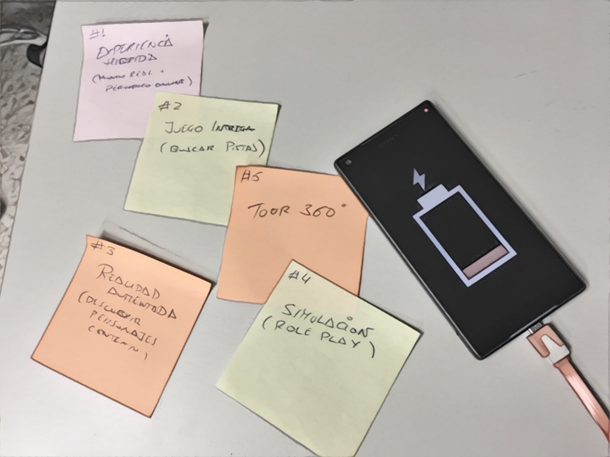
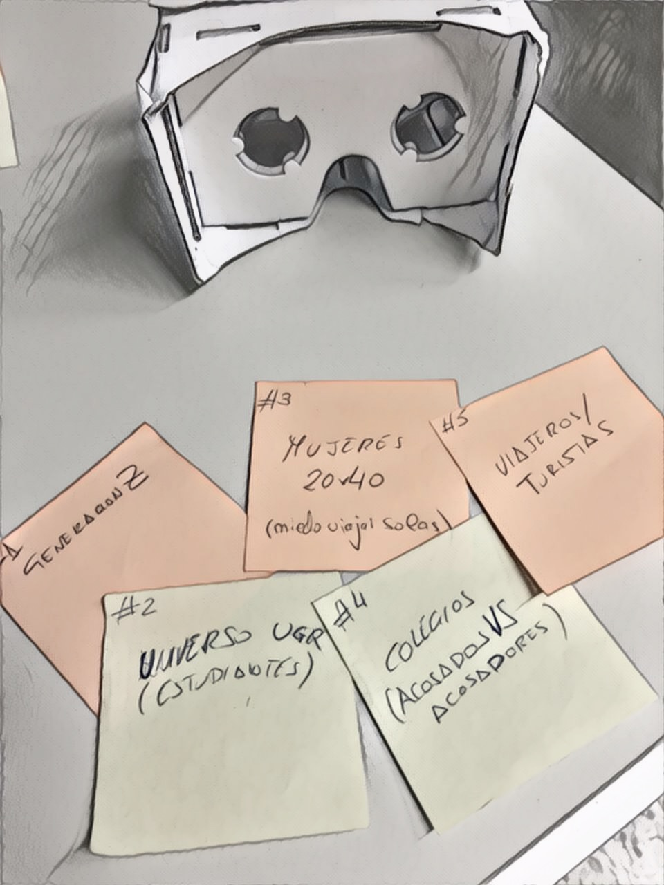
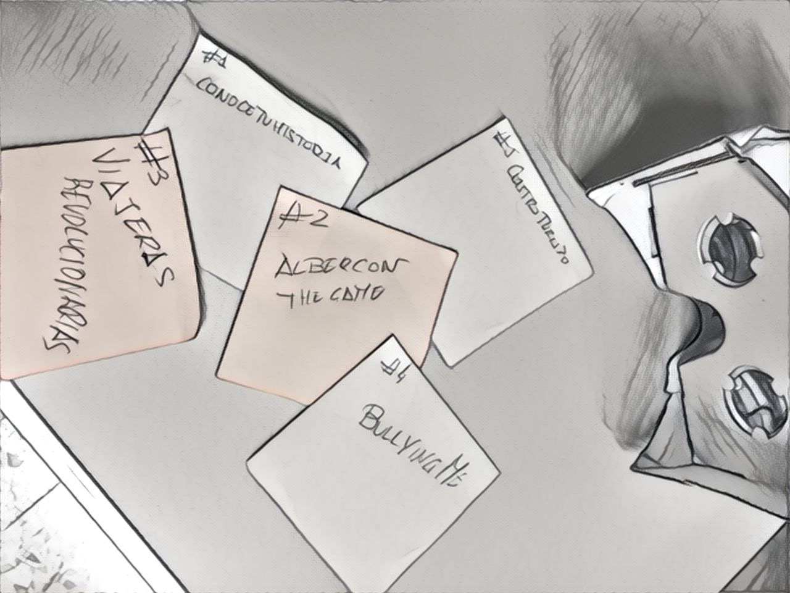
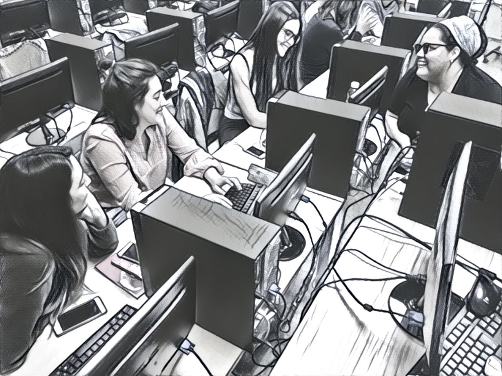
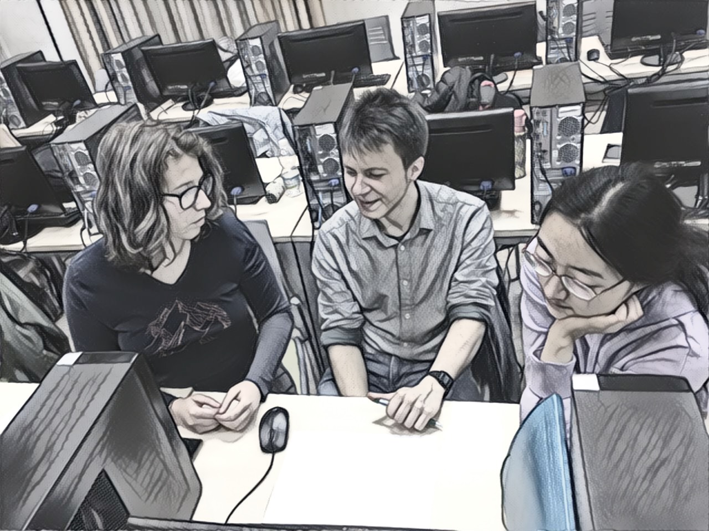
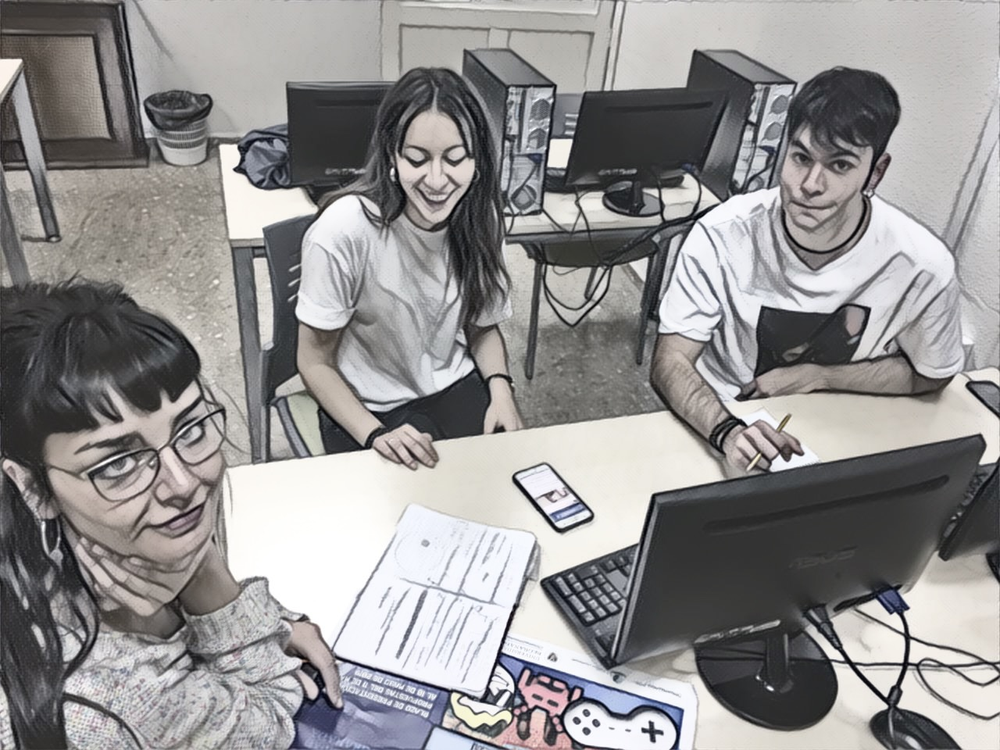
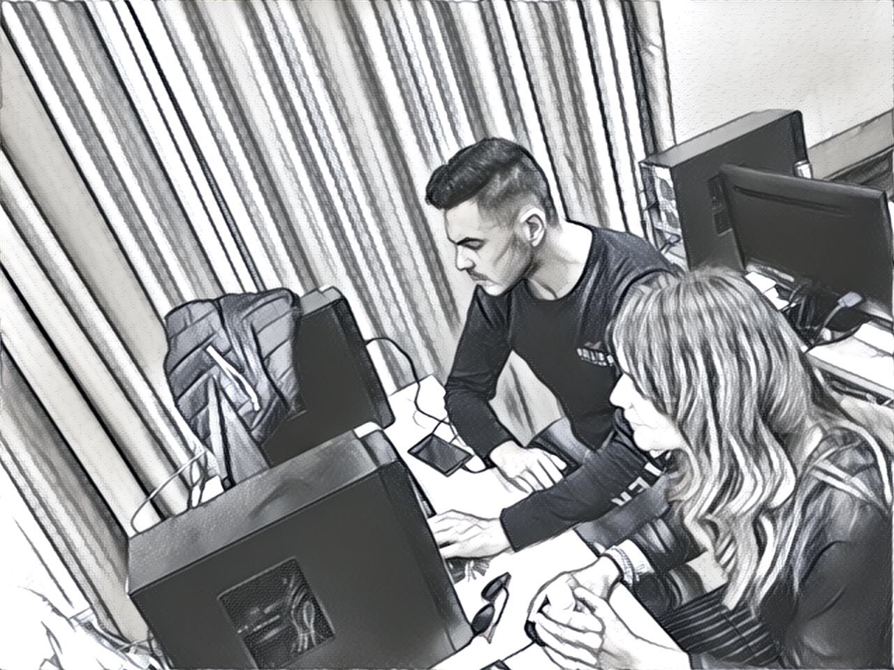

# PeriodismoMultimedia19

Proyectos que se van a desarrollar 

Generación de ideas: 

* Temáticas

 

* Público objetivo

* Experiencia

#1 -  CONOCE TU HISTORIA: Los Hermanos Quero
========================================

*   :octocat: [Los Hermanos Quero](https://github.com/andreafallen95/PeriodismoMultimedia/blob/master/README.md)

* Autores: Julia Calvache, Andrea, Mª Carmen Rodriguez
* DIRIGIDO A: Generación Z
* Experiencia: Hibrida Real/Periodico online	
		

#2 -  Videojuego
========================================
* :octocat: [Albercon the Game](https://github.com/Dvdcillo/PeriodismoMultimedia/blob/master/README.md)

 

#3 -  i-doc
========================================

* [Viajeras Revolucionarias](https://github.com/MariJose13/ViajerasRevolucionarias) 

* Autores: Mª José Caballero, Fco Jesus, Mágina Cruz, Carmen Pérez

    
		
		

#4 - CyberBulling
========================================
* Autores: Adriana Bayona, Encarnación Jimenez
 
* :octocat:  
		

#5 - Gastroturismo
========================================
* Autores: Lucía Romero, Ariadna, Paul

* Argumento:     
* :octocat: 	

